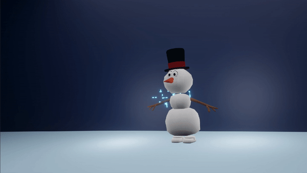

# Magic Snow
### Code used within Blender to create a particle system represeting magical snow particles.

## Summary of Techniques Implemented
Using a Boids-like particle system implementation which incorporates the three boids forces, (separation, cohesion and alignment) this code is used to create particle system of many "magic snow" particles which is used in a short Blender made, "Frosty the Snowman" inspired animation.
In addition to the simple particle system implementation, a basic collision detection technique is used to keep the snow particle within the vicinity of the snowman within the Blender animation. With the combination of these two techniques creates a "magic spell-like" snow particle system when run within Blender.

**Note**: A short vector/ collision library is included at the top of the Python script, and is used for vector and collision calculations performed within the code.

## Usage Notes
This code is written in Python 3 and is meant to be run within Blender. The Blender file is not included in this repo.

## Result

